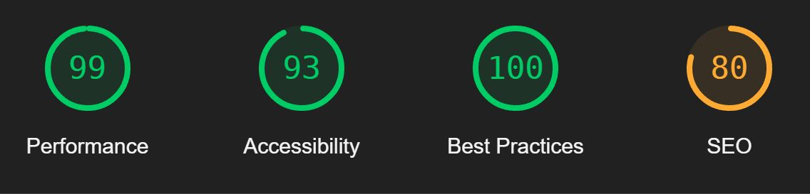

# AWOBUD - [www.awobud.com](https://www.awobud.com/) 
[![Forks][forks-shield]][forks-url]
[![Stargazers][stars-shield]][stars-url]
[![Issues][issues-shield]][issues-url]
[![LinkedIn][linkedin-shield]][linkedin-url]

## A website for a construction company.

The site is featured as a business card with a functional contact form. 

### Website goals:

- Increase awareness of the company
- Present the works done by the company
- Provide various contact options

### Technology stack:
                               
 [![JavaScript][JavaScript]][JavaScript-url]

 [![HTML][html.com]][html-url]

 [![CSS3][css.com]][css-url]

 [![SCSS][sass.com]][sass-url]

## Tests in cypress

I decided to use cypress to do e2e test for every app in my project. 
 
 
![cypress-raport-screenshot]

You can find all CI results recorded on the 
 
https://dashboard.cypress.io/projects/ybrdtr/runs/1/overview
  

### Lighthouse result 

[forks-shield]: https://img.shields.io/github/forks/WiktorW-pl/AWOBUD?style=for-the-badge
[forks-url]: https://github.com/WiktorW-pl/AWOBUD/network/members
[stars-shield]: https://img.shields.io/github/stars/WiktorW-pl/AWOBUD?style=for-the-badge
[stars-url]: https://github.com/WiktorW-pl/AWOBUD/stargazers
[issues-shield]: https://img.shields.io/github/issues/WiktorW-pl/AWOBUD?style=for-the-badge
[issues-url]: https://github.com/WiktorW-pl/AWOBUD/issues
[linkedin-shield]: https://img.shields.io/badge/-LinkedIn-black.svg?style=for-the-badge&logo=linkedin&colorB=555
[linkedin-url]: https://www.linkedin.com/in/wiktor-wo%C5%BAny-562708237/
[JavaScript]: https://img.shields.io/badge/JavaScript-F7DF1E?style=for-the-badge&logo=javascript&logoColor=black
[JavaScript-url]: https://www.javascript.com/
[html.com]: 	https://img.shields.io/badge/HTML5-E34F26?style=for-the-badge&logo=html5&logoColor=white
[html-url]: https://html.com/
[sass.com]: https://img.shields.io/badge/Sass-CC6699?style=for-the-badge&logo=sass&logoColor=white
[sass-url]: https://sass-lang.com/
[css.com]: https://img.shields.io/badge/CSS3-1572B6?style=for-the-badge&logo=css3&logoColor=white
[css-url]: https://developer.mozilla.org/en-US/docs/Web/CSS
[cypress-raport-screenshot]: 